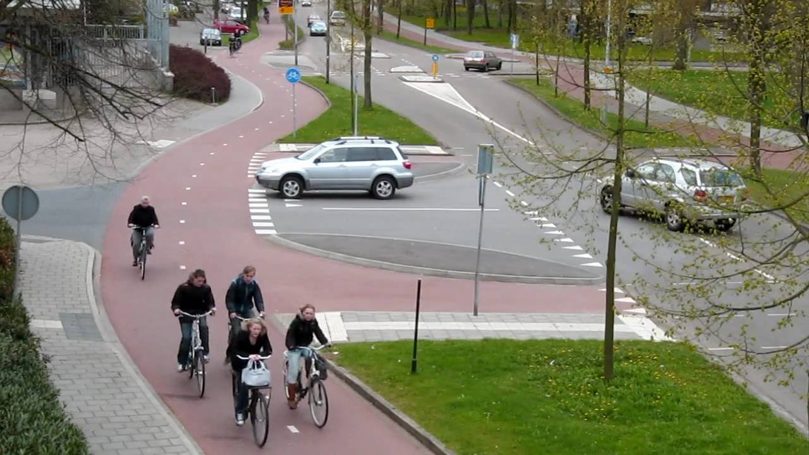

### [Cheese and Wine Tour](beers-bikes-boulangerie/Overview.md)

Bike rentals are plentiful in Belgium and The Netherlands, it's just a question of whether there are any companies willing to pick up and drop off bikes, and how far away from their headquarters they are willing to go to do that.

Information on bike hire in The Netherlands: [Holland Cycling Routes](https://www.hollandcyclingroutes.com/practical/cycle-hire-and-parking)

**Rental Websites:**
- [wiel-rent](https://www.wiel-rent.nl/en/rent/hybrid-bicycles/) : Has rentals out of Bruges. No drop-offs for hybrid bikes in Groningen, but there might be one in [Delfzijl-Appingedam](https://www.google.com/maps/place/Appingedam,+Netherlands/@53.3186434,6.7758542,12z/data=!3m1!4b1!4m5!3m4!1s0x47b629ce9e01480b:0x6c9c33fa95191ccb!8m2!3d53.3206783!4d6.8544218), but I would need to check if they do pick-ups at all.
- [ListNRide](https://www.listnride.com/about): Service for renting bikes by owner. Potentially a deal to be had here.
- [Dutch Biketours](https://www.dutch-biketours.com/cycling-holiday-bruges-amsterdam): This company does linear tours, one of which goes from Paris to Amsterdam, so certainly they have the range to do what we need, but the question remains of whether they will allow us to customize at all. We don't really want to follow their route necessarily, we just want the bikes.

**Bike Rental in Bruges:**
- [Ben's BIke](https://www.visitbruges.be/en/b-bike)
- [The Chain (De Ketting)](http://www.deketting.be/verhuur.htm)

**Bike Rental in Utrecht:**
- [Eurobike](https://eurobikeshop.nl/verhuur/)

**Bike Rental in Amsterdam:**
- [Rent a Bike](https://www.rentabike.nl/en/hybrid-bike)
- [A-Bike](https://a-bike.nl/rent-a-bike-in-amsterdam/)
- [Quality Bike Rent Amsterdam](https://www.qualitybikerentamsterdam.nl/bike-rental/)
- [Discount Bike Rental](https://www.discountbikerental.nl/product/touring-bike/)
	- Looks promising
- [Bike City](https://bikecity.nl/bike-rental/hybrid-bike/)
	- Also promising
- [King Bikes](https://kingbikes.nl/bike-rental/)

**Bike Rental in Copenhagen:**
- [Fri BikeShop](https://www.fribikeshop.dk/butikker/koebenhavn/noerrebro)
- [Copenhagen Cycles](https://copenhagenbicycles.dk/)
- [Bike Rental Copenhagen](https://baisikeli.dk/bike-rental/)

## Traveling on Trains with Bikes
Dutch Rail: [Bikes on the Train](https://www.ns.nl/en/travel-information/bikes-on-the-train.html)
