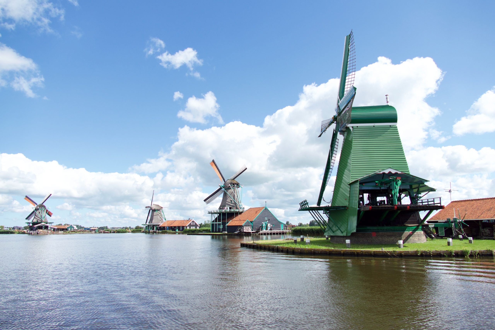

# Beers, Bikes, and Boulangerie

### A Tour through Four Countries

## Countries
[France](countries/France.md) - [Belgium](countries/Belgium.md) - [Nederland](countries/nederland/Nederland.md) - [Denmark](countries/Denmark.md)

## Logistics
[Schedule](Schedule.md) - [Bikes](Bikes.md)

### Origin of the trip

In 2020, our plan to take three weeks bike touring through in Greece fell through due to the pandemic. We took a consolation trip down the McCarthy road instead, but we never ended up going to Greece. By the summer of 2022, it had been four years since our last tour, which was in Scotland.
One day that summer, Dad started yearning aloud about how it had been too long since we had done a bike tour together. I suggested that we tour The Netherlands. He suggested starting in Calais and doing Belgium, too.

So I thought, why stop there?

My original plan involved a sprawling tour starting in Calais and ending in Copenhagen. After speaking to the family and refining the plan with Mom, We came up with a more streamlined trip that would still hit the best cities in the original plan, but would be logistically simpler and allow for different paces of travel.

### High Level Summary

We will begin by spending a few days in Paris and Copenhagen, flying from one to the other. After that, we will travel to Bruges, where we will pick up our bikes and begin our ride. We will travel North toward Amsterdam, visiting cities along the way. After Amsterdam, we will split into smaller groups and go our separate ways, according to interest.

#### The Route on Google Maps

[Flight from Copenhagen to Paris](https://www.google.com/maps/dir/Copenhagen,+Denmark/Paris,+France/@52.0421116,3.9907007,6.25z/data=!4m15!4m14!1m5!1m1!1s0x4652533c5c803d23:0x4dd7edde69467b8!2m2!1d12.5683372!2d55.6760968!1m5!1m1!1s0x47e66e1f06e2b70f:0x40b82c3688c9460!2m2!1d2.3522219!2d48.856614!3e4!4e1)

[Train trip from Paris to Bruges](https://www.google.com/maps/dir/Paris,+France/Bruges,+Belgium/@49.8406712,3.4000694,8z/data=!4m15!4m14!1m5!1m1!1s0x47e66e1f06e2b70f:0x40b82c3688c9460!2m2!1d2.3522219!2d48.856614!1m5!1m1!1s0x47c350d0c11e420d:0x1aa2f35ac8834df7!2m2!1d3.2247552!2d51.2091807!3e0!4e1)

[Cycle Route from Bruges to Amsterdam](https://www.google.com/maps/dir/Bruges,+Belgium/Vlissingen,+Netherlands/Zierikzee,+Netherlands/Willemstad,+Netherlands/Papendrecht,+Netherlands/Rotterdam,+Netherlands/Gouda,+Netherlands/Amsterdam,+Netherlands/@51.6356336,4.3544087,9z/data=!4m51!4m50!1m5!1m1!1s0x47c350d0c11e420d:0x1aa2f35ac8834df7!2m2!1d3.2247552!2d51.2091807!1m5!1m1!1s0x47c499eddc5a203d:0x88182e73f1865efb!2m2!1d3.5709125!2d51.4536672!1m5!1m1!1s0x47c45f89cb2d4b3d:0xf722f31927b46eed!2m2!1d3.9184977!2d51.6501218!1m5!1m1!1s0x47c43bff78254867:0xa07efca5fb1568e9!2m2!1d4.4379073!2d51.6919469!1m5!1m1!1s0x47c42945ff78fd7d:0x352688697d2caeb7!2m2!1d4.6941834!2d51.8424811!1m5!1m1!1s0x47c5b7605f54c47d:0x5229bbac955e4b85!2m2!1d4.4777326!2d51.9244201!1m5!1m1!1s0x47c5d6abf5be06cb:0x52baf414500565a3!2m2!1d4.7104633!2d52.0115205!1m5!1m1!1s0x47c63fb5949a7755:0x6600fd4cb7c0af8d!2m2!1d4.9041389!2d52.3675734!3e1!4e1)

### Why these countries?

#### Cycling Heaven
The Netherlands and Denmark are widely regarded as having world-class cycling infrastructure. Belgium is not far behind. Taken together, they form what very well may be the most bike-friendly region of the world, *bar none.* I feel that experiencing what the world would be like if everyone rode bikes to be a worthwhile goal.

#### New Territory
I can recall briefly passing through Schiphol Airport on our way to somewhere else before, but none of us have done a proper tour of Belgium, The Netherlands, or Denmark. It would be a new experience for all of us.

### Time to Complete: ~3 weeks

See this page for a more detailed schedule: [Schedule](Schedule.md)
