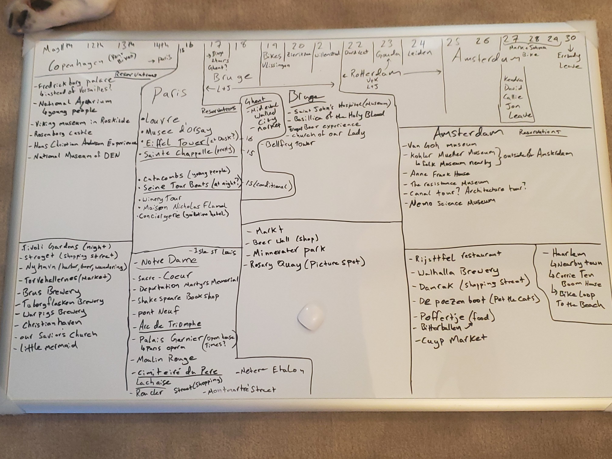

### [Beers, Bikes, and Boulangerie](Overview.md)

# Full Trip Schedule
This is a day-by-day timeline of the trip for the biking group. Each item on the list has a starting and ending city, indicating where we will be traveling to each day. This will fill out more and more as trip planning continues.

### The Brainstorm Board

#### The Route on Google Maps

[Flight from Copenhagen to Paris](https://www.google.com/maps/dir/Copenhagen,+Denmark/Paris,+France/@52.0421116,3.9907007,6.25z/data=!4m15!4m14!1m5!1m1!1s0x4652533c5c803d23:0x4dd7edde69467b8!2m2!1d12.5683372!2d55.6760968!1m5!1m1!1s0x47e66e1f06e2b70f:0x40b82c3688c9460!2m2!1d2.3522219!2d48.856614!3e4!4e1)

[Train trip from Paris to Bruges](https://www.google.com/maps/dir/Paris,+France/Bruges,+Belgium/@49.8406712,3.4000694,8z/data=!4m15!4m14!1m5!1m1!1s0x47e66e1f06e2b70f:0x40b82c3688c9460!2m2!1d2.3522219!2d48.856614!1m5!1m1!1s0x47c350d0c11e420d:0x1aa2f35ac8834df7!2m2!1d3.2247552!2d51.2091807!3e0!4e1)

[Cycle Route from Bruges to Amsterdam](https://www.google.com/maps/dir/Bruges,+Belgium/Vlissingen,+Netherlands/Zierikzee,+Netherlands/Willemstad,+Netherlands/Papendrecht,+Netherlands/Rotterdam,+Netherlands/Gouda,+Netherlands/Amsterdam,+Netherlands/@51.6356336,4.3544087,9z/data=!4m51!4m50!1m5!1m1!1s0x47c350d0c11e420d:0x1aa2f35ac8834df7!2m2!1d3.2247552!2d51.2091807!1m5!1m1!1s0x47c499eddc5a203d:0x88182e73f1865efb!2m2!1d3.5709125!2d51.4536672!1m5!1m1!1s0x47c45f89cb2d4b3d:0xf722f31927b46eed!2m2!1d3.9184977!2d51.6501218!1m5!1m1!1s0x47c43bff78254867:0xa07efca5fb1568e9!2m2!1d4.4379073!2d51.6919469!1m5!1m1!1s0x47c42945ff78fd7d:0x352688697d2caeb7!2m2!1d4.6941834!2d51.8424811!1m5!1m1!1s0x47c5b7605f54c47d:0x5229bbac955e4b85!2m2!1d4.4777326!2d51.9244201!1m5!1m1!1s0x47c5d6abf5be06cb:0x52baf414500565a3!2m2!1d4.7104633!2d52.0115205!1m5!1m1!1s0x47c63fb5949a7755:0x6600fd4cb7c0af8d!2m2!1d4.9041389!2d52.3675734!3e1!4e1)

#### Day-by-Day Breakdown

1. **May 11th**: Copenhagen
	- Accommodation: [STAY Nordhavn](https://www.google.com/maps/place/STAY+Nordhavn/@55.7090262,12.5919362,17z/data=!3m1!4b1!4m8!3m7!1s0x4652536f63fd62f7:0x416d1e39a4535976!5m2!4m1!1i2!8m2!3d55.7090232!4d12.5941249)
2. **May 12th**: Layover: Copenhagen
3. **May 13th**: Layover: Copenhagen
4. **May 14th**: Copenhagen - Paris
	- Accommodation: [Residence Inn at Charles de Gaulle](https://www.google.com/maps/place/Residence+Inn+by+Marriott+Paris+Charles+de+Gaulle+Central+Airport/@49.0085254,2.5492476,17.75z/data=!4m8!3m7!1s0x47e615e99c8100e1:0x37471713b70df14d!5m2!4m1!1i2!8m2!3d49.0086145!4d2.5492074)
5. **May 15th**: Layover: Paris
	- Change of Accommodation: [Gare de Lyon Courtyard](https://www.google.com/maps/place/Courtyard+by+Marriott+Paris+Gare+de+Lyon/@48.8490825,2.366516,15.5z/data=!4m8!3m7!1s0x47e6721ca8d17de9:0x7a5a6955cce83c07!5m2!4m1!1i2!8m2!3d48.8451267!4d2.3712969)
	- Walking tour of City Center in the morning
	- 12:30 PM St Chappelle tour
		- Parents also touring the Conciergerie
	- The Louvre
	- Boat cruise on the Seine
6. **May 16th**: Layover: Paris
	- Catacombs of Paris
7. **May 17th**: Paris - Bruges (Ghent?)
	- Accommodation: [Grand Hotel Normandy](https://www.google.com/maps/place/Grand+Hotel+Normandy/@51.208436,3.2293056,15.57z/data=!4m9!3m8!1s0x47c350d8318bfffd:0x1451f31c63d31a37!5m2!4m1!1i2!8m2!3d51.2078813!4d3.2153783!16s%2Fg%2F11rfp8h767)
8. **May 18th**: Layover: Bruges
9. **May 19th**: Bruges - Vlissingen
	- We get our bikes in the morning
	- Accommodation: [Stadshotel Vlissingen](https://www.google.com/maps/place/Stadshotel+Vlissingen/@51.4432525,3.571842,17z/data=!3m1!4b1!4m8!3m7!1s0x47c49969cb48777b:0x51d901928427c2d9!5m2!4m1!1i2!8m2!3d51.4432492!4d3.5740307)
10. **May 20th**: Vlissingen - Zierikzee
	- Accommodation: [B&B De Schuur](https://www.google.com/maps/place/B%26B+De+Schuur/@51.6480168,3.9141933,17z/data=!3m1!4b1!4m8!3m7!1s0x47c4f5636ff67715:0xf3e3fde84713e69a!5m2!4m1!1i2!8m2!3d51.6479732!4d3.9163711)
11. **May 21st**: Zierikzee - Willemstad
	- Accommodation: [Het Wapen](https://www.google.com/maps/place/Het+Wapen+%7C+Willemstad/@51.6943437,4.4398815,209m/data=!3m1!1e3!4m8!3m7!1s0x47c43957f5714003:0xc91d83bf21221cb1!5m2!4m1!1i2!8m2!3d51.6945279!4d4.4398881!5m1!1e3)
12. **May 22nd**: Willemstad - Dordrecht
	- Accommodation: [StayOkay Hostel Dordrecht](https://www.google.com/maps/place/Stayokay+Hostel+Dordrecht/@51.7993226,4.7594223,13.75z/data=!4m8!3m7!1s0x47c429c6096763af:0x1745506f814e76d4!5m2!4m1!1i2!8m2!3d51.8104041!4d4.751512)
13. **May 23rd**: Dordrecht - Gouda
	- Accommodation: [Canalhouse Aan de Gouwe](https://www.google.com/maps/place/Canalhouse+Aan+de+Gouwe/@52.0090055,4.7121718,17z/data=!4m8!3m7!1s0x47c5d4031aebffff:0xf6bba778284bc140!5m2!4m1!1i2!8m2!3d52.0091084!4d4.7115929)
14. **May 24th:** Gouda - Leiden
	- Accommodation: [Landgoed Oud-Poelgeest](https://maps.app.goo.gl/cPW2L97bDfKVBfLV6)
		- Still labeled as Best Western on the map, but it's the same hotel
15.  **May 25th:** Leiden - Amsterdam
	- Accommodation: [Holiday Inn Express Sloterdijk](https://maps.app.goo.gl/b9fK48AuRYdnDdhH8)
	16. **May 26th**: Layover: Amsterdam
	- Van Gough Museum, 10:30 and 11:15
17. **May 27th:** Mark and Johnna: Amsterdam - Luttelgeest
18. **May 28th:** Mark and Johnna: Luttelgeest - Groningen
19. **May 29th:** Mark and Johnna: Groningen - Amsterdam
