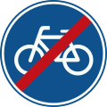
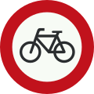
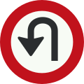
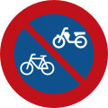
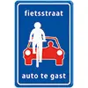
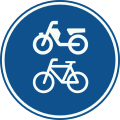

# Dutch Road Signs

## Slash means "End"

If you see a sign with a slash through it, that generally means "end of."

Leaving the town of Helmond

End of Bike Route **(Not "No Bikes")**

## Red circle means "No"

In the US, we would take a red circle to mean something like "caution." In much of Europe, the red circle means something is not allowed.

No Bikes

No U-Turn

Here is an exception: No Bike Parking

## Some streets are for bikes

This sign means both bikes and cars are allowed on the street, but bikes take priority. Cars are guests.

## Some bike paths allow mopeds

I don't like this much, but yes, sometimes you'll just have to accept that a moped is about to zip past you.
