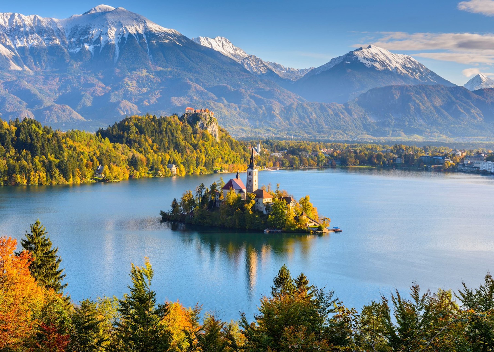

In 2010, our family took a bike tour in Croatia. To reach the place where we would begin biking, we drove to Croatia from Italy. On the way there, we passed through a country that was green and mountainous and beautiful, and we said to ourselves, "this would be a great place to visit."

Slovenia has been in the back of our minds ever since. In every discussion about the location for our next adventure, we always make sure to bring up this little country at least once. No more. Let's commit to the dream and tour across this hidden gem at the heart of Europe.

I propose an east-to-west traversal of the country, from the provincial city of Maribor all the way to the Adriatic coast, to the village of Piran. Along the way we will explore castles, eat marvelous food, gawk at the mountains, and drink copious amounts of good Slovene wine.
## [Proposed Cities](https://maps.app.goo.gl/5Tj7WXyMAXsPEW348)

**Sources**

https://www.cyclingslovenia.com/self-guided/best-of-slovenia